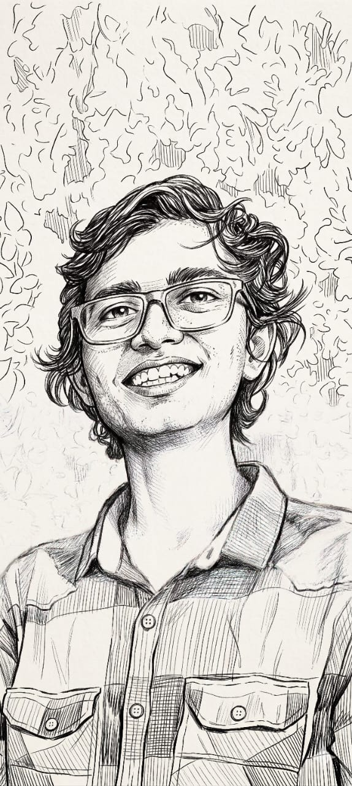

<!--
  Ink & Code — GitHub profile README for Rajat9632
  Sketch portrait is the brand. Keep the monochrome energy.
-->

  

    

  <h1>Rajat</h1>

  
<strong>ink &amp; code</strong>

  

   

  

  

    <em>Not another generic developer card — a builder who turns rough ideas into real products.</em>
  

  

    
    &nbsp;
    
  

 

## ✎ on the desk

Things I’m actively shaping — fewer projects, more craft.

<table>
  <tr>
    <td width="50%" valign="top">
      <h3><a href="https://github.com/Rajat9632/FitYou---Fit_Ai">FitAi</a></h3>
      AI-driven workouts and diets that adapt to the person, not a template.
       <code>Python · AI</code>
    </td>
    <td width="50%" valign="top">
      <h3><a href="https://github.com/Rajat9632/krishi">krishi</a></h3>
      Agri-tech experiments where software meets soil, season, and real farmers.
       <code>in progress</code>
    </td>
  </tr>
  <tr>
    <td width="50%" valign="top">
      <h3><a href="https://github.com/Rajat9632/ArtConnect">ArtConnect</a></h3>
      A creative space for artists to share work and find each other.
       <code>JavaScript</code>
    </td>
    <td width="50%" valign="top">
      <h3><a href="https://github.com/Rajat9632/Ai-Agent-course">AI Agents</a></h3>
      Learning (and shipping) agentic systems that actually do useful work.
       <code>AI · Agents</code>
    </td>
  </tr>
</table>

 

## ✎ in the toolkit

  `Python` &nbsp;·&nbsp; `JavaScript` &nbsp;·&nbsp; `TypeScript` &nbsp;·&nbsp; `HTML/CSS`  
  `AI / Agents` &nbsp;·&nbsp; `Full-stack` &nbsp;·&nbsp; `DevOps` &nbsp;·&nbsp; `Product thinking`

 

## ✎ ink trail

  <picture>
    <source media="(prefers-color-scheme: dark)" srcset="https://github-readme-stats.vercel.app/api?username=Rajat9632&show_icons=true&include_all_commits=true&count_private=true&hide_border=true&bg_color=0D1117&title_color=E6EDF3&text_color=ADBAC7&icon_color=C9D1D9&ring_color=8B949E" />
    
  </picture>
  &nbsp;
  <picture>
    <source media="(prefers-color-scheme: dark)" srcset="https://github-readme-stats.vercel.app/api/top-langs/?username=Rajat9632&layout=compact&hide_border=true&bg_color=0D1117&title_color=E6EDF3&text_color=ADBAC7" />
    
  </picture>

 

  <picture>
    <source media="(prefers-color-scheme: dark)" srcset="https://streak-stats.demolab.com?user=Rajat9632&hide_border=true&background=0D1117&stroke=30363D&ring=8B949E&fire=C9D1D9&currStreakLabel=ADBAC7&sideLabels=ADBAC7&currStreakNum=E6EDF3&sideNums=E6EDF3&dates=8B949E" />
    
  </picture>

 

  

  

    
      <b>fun fact under the sketch:</b> that portrait is ink, not a filter —
      same energy I try to bring to code: deliberate lines, a little texture, human.
    
  

  

    ✦ open to collabs, weird ideas, and projects that matter ✦
  

